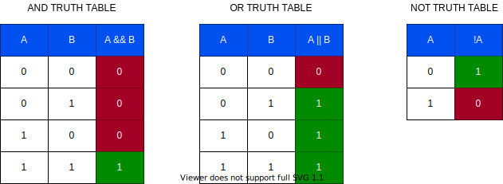
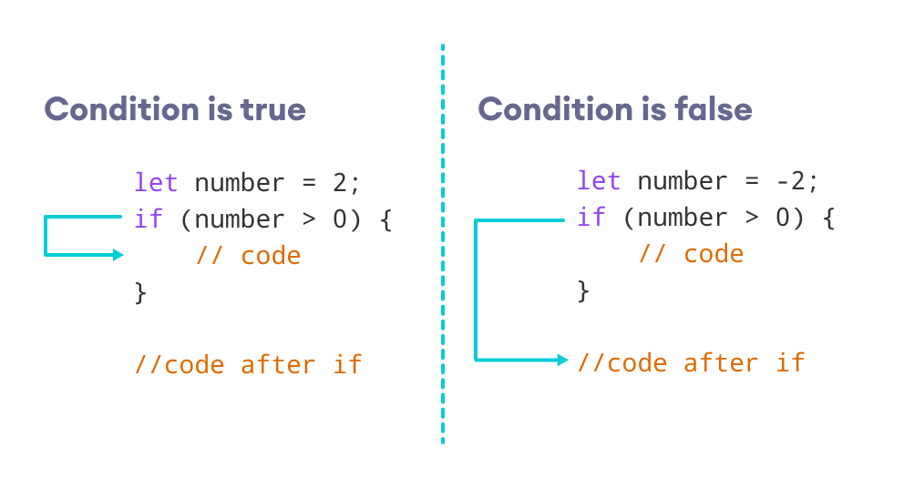
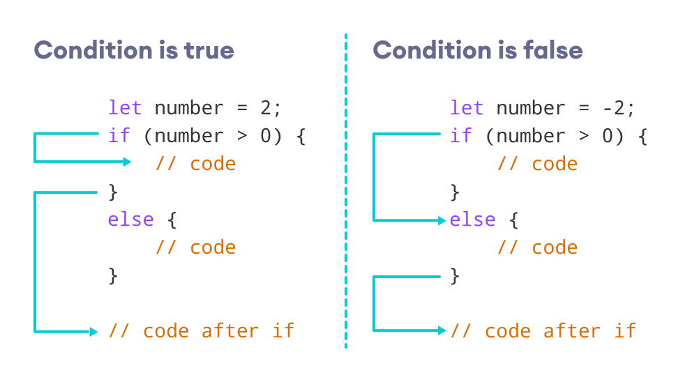
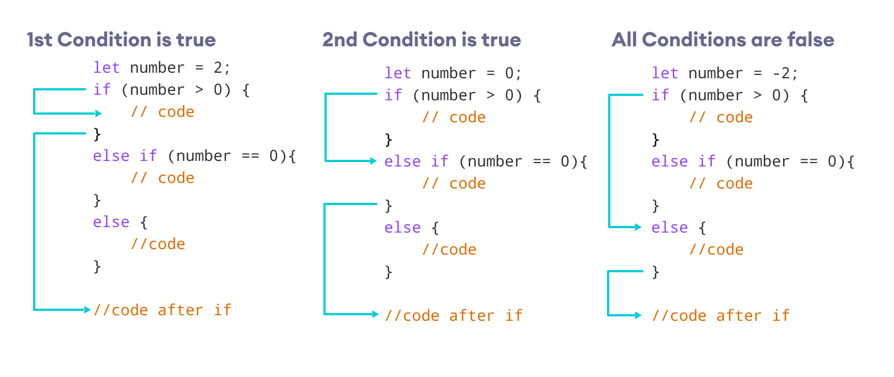
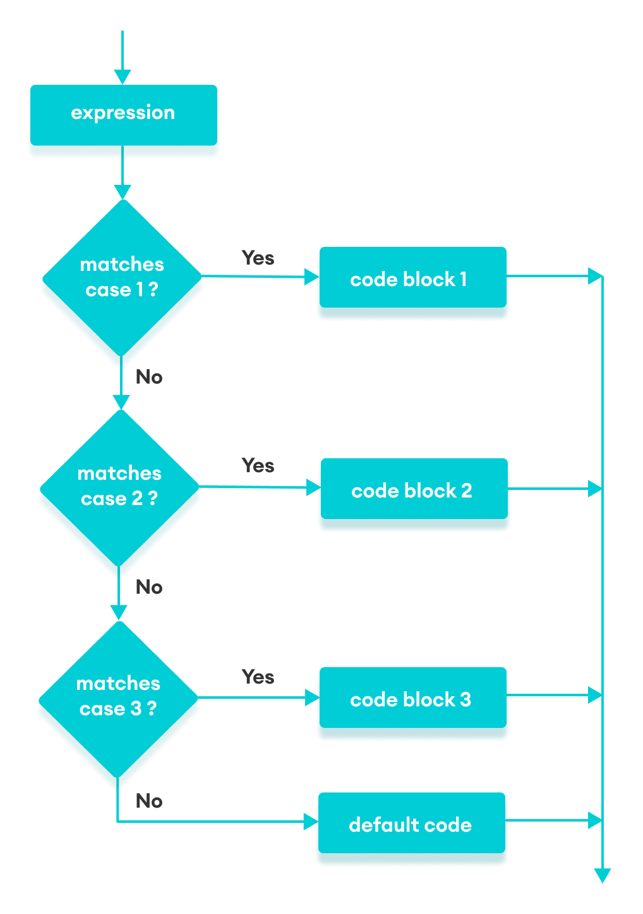

# Session-03 - Operators & Conditionals

## Operators

JavaScript has the following types of operators. This section describes the operators and contains information about operator precedence.

- [Arithmetic operators](https://developer.mozilla.org/en-US/docs/Web/JavaScript/Guide/Expressions_and_Operators#arithmetic_operators)

  - In addition to (`+`, `-`, `*`, `/`), remainder: `%`, unary plus`++`, unary minus `--`, unary negation `-`, unary plus `+`,  exponentiation`**`

- [Assignment operators](https://developer.mozilla.org/en-US/docs/Web/JavaScript/Guide/Expressions_and_Operators#assignment_operators)

- [Logical operators](https://developer.mozilla.org/en-US/docs/Web/JavaScript/Guide/Expressions_and_Operators#logical_operators)

  and or not *no xor* in high level

  

- [Bitwise operators](https://developer.mozilla.org/en-US/docs/Web/JavaScript/Guide/Expressions_and_Operators#bitwise_operators)

  - To do some bit level logic operations at 32bits (zeros and ones)
  - logical plus xor, shift left, shift right , zero fill shift right

- [Comparison operators](https://developer.mozilla.org/en-US/docs/Web/JavaScript/Guide/Expressions_and_Operators#comparison_operators)

  equal and strict equal, greater than, greater than or equal to, less than,  less than or equal to, not equal, strict not equal

- [String operators](https://developer.mozilla.org/en-US/docs/Web/JavaScript/Guide/Expressions_and_Operators#string_operators)

  in addition to comparison  addition operator

- [Conditional (ternary) operator](https://developer.mozilla.org/en-US/docs/Web/JavaScript/Guide/Expressions_and_Operators#conditional_ternary_operator) *We will cover later*

- [Comma operator](https://developer.mozilla.org/en-US/docs/Web/JavaScript/Guide/Expressions_and_Operators#comma_operator)

- [Unary operators](https://developer.mozilla.org/en-US/docs/Web/JavaScript/Guide/Expressions_and_Operators#unary_operators)

  typeof, delete (from object), in, instance of

- [Relational operators](https://developer.mozilla.org/en-US/docs/Web/JavaScript/Guide/Expressions_and_Operators#relational_operators)

  in, instanceof

> *source:https://developer.mozilla.org/en-US/docs/Web/JavaScript/Guide/Expressions_and_Operators*

Js has unary, binary and one ternary operator.

- **binary operators** requires two operands

  *operand* **operator** *operand*

- **unary operator**

  **operator** *operand* 	or	*operand* **operator**

### Operator Precedence

[operator precedence table](https://developer.mozilla.org/en-US/docs/Web/JavaScript/Reference/Operators/Operator_Precedence#table)

## Conditionals

We will discuss conditionals in JavaScript.
There are 3 types of conditional structures:

## if else statements

There are 3 forms of if blocks:

1. **simple `if` statement**

   syntax is simple:

   ```js
   if (condition) {
       the if block body
       // some code here
   }
   followingCommands();
   
   // for single commands no need for curly braces, beware of that!
   if (condition) command;
   followingCommands();
   ```

   **Flow of execution**

   

   > *source: https://www.programiz.com/javascript/if-else*

   **Example 1: if Statement**

   ```js
   // check if the number is positive
   const number = prompt("Enter a number: ");
   // enter either positive or negative number to check the output
   // check if number is greater than 0
   if (number > 0) {
    // the body of the if statement
     console.log("The number is positive");
   }
   console.log("The if statement is easy");
   ```

2. **`if ..  else` statement**

   Now we have else option on the table:

   ```js
   if (condition) {
       // block of code if condition is true
   } else {
      // block of code if condition is false
   }
   ```

   **Flow of execution**

   

   **Example 2 : if…else Statement**

   ```js
   // check is the number is positive or negative/zero
   const number = prompt("Enter a number: ");
   // check if number is greater than 0
   if (number > 0) {
     console.log("The number is positive");
   } else { // if number is not greater than 0
     console.log("The number is either a negative number or 0");
   }
   console.log("The if...else statement is easy");
   ```

   with single statement:

   ```js
   const number = 2;
   if (number > 0)
       console.log("The number is positive.");
    else 
      console.log("The number is negative or zero.");
   ```

3. **`if .. else if .. else` statement**

   This  extended statement gives us more options to compare more than two conditions.

   ```js
   if (condition1) {
       // code block 1
   } else if (condition2){
       // code block 2
   } else if (condition3){ // we can add as much as we need to
       // code block 3
   } else if (condition4){ // we can add as much as we need to
       // code block 4
   } else {
       // code block 3
   }
   ```

   **Flow of execution**

   

**Example 3: if...else if Statement**

```js
// check if the number if positive, negative or zero
const number = prompt("Enter a number: ");

// check if number is greater than 0
if (number > 0) {
    console.log("The number is positive");
} else if (number == 0) { // check if number is 0
  console.log("The number is 0");
} else { // if number is neither greater than 0, nor zero
  console.log("The number is negative");
}
console.log("The if...else if...else statement is easy");
```

- **nested if blocks**

  We can write `if .. else` statement inside of an `if .. else` block.

  **Example 4: Nested if...else Statement**

  ```js
  // check if the number is positive, negative or zero
  const number = prompt("Enter a number: ");
  
  if (number >= 0) {
      if (number == 0) {
          console.log("You entered number 0");
      } else {
          console.log("You entered a positive number");
      }
  } else {
      console.log("You entered a negative number");
  }
  ```

- separate if statements `if .. if .. if` vs cascaded  if statements`if .. else if .. else` vs nested if statements  `if .. if .. else if .. if .. else if`

  **separate if statement of the same example**

  ```js
  // check if the number if positive, negative or zero
  const number = prompt("Enter a number: ");
  
  // check if number is greater than 0
  if (number > 0) {
      console.log("The number is positive");
  } 
  if (number == 0) { // check if number is 0
    console.log("The number is 0");
  } else { // if number is neither greater than 0, nor zero
    console.log("The number is negative");
  }
  console.log("The if...else if...else statement is easy");
  ```


## Ternary statements

  > A ternary operator can be used to replace an if..else statement in certain situations.
> The ternary operator takes three operands, hence, the name ternary operator. It is also known as a conditional operator.

This is an expression, so we can use it on the right side of a statement. Meaning that, we can assign the result to another variable.

  - Where is it used?
    It is usually used in simple comparisons to get a result. Ternary blocks can be nested, however it is not recommended, since makes your code hard to comprehend.
  
- How is it structured?
  
    ```js
    condition ? expression1 : expression2
    ```
  The ternary operator evaluates the test condition.
  
  - If the condition is true, expression1 is executed.
  
    - If the condition is false, expression2 is executed.

Let's give some examples:

```js
// program to check pass or fail

let grade = prompt('Enter your score :');

// check the condition
let result = (grade >= 50) ? 'pass' : 'fail';

console.log(`You ${result} the exam.`);
```

```js
// check the age to determine the eligibility to vote
let age = 15;
let result;

if (age >= 18) {
      result = "You are eligible to vote.";
} else {
      result = "You are not eligible to vote yet.";
}

console.log(result);
```

same code can be written as below: 

```js
// ternary operator to check the eligibility to vote
let age = 15;
let result =
    (age >= 18) ? "You are eligible to vote." : "You are not eligible to vote yet";
console.log(result);
```

### nested ternary (:exclamation: avoid using)

```js
// program to check if number is positive, negative or zero
let a = 3;
let result = (a >= 0) ? (a == 0 ? "zero" : "positive") : "negative";
console.log(`The number is ${result}.`);
```

## `switch case` block

Extended version of if statement for decision making.

The syntax of the `switch` statement is:

```js
switch(variable/expression) {
    case value1:  
        // body of case 1
        break;

    case value2:  
        // body of case 2
        break;

    case valueN:
        // body of case N
        break;

    default:
        // body of default
}
```

**Flow of execution**



```js
// program using switch statement
let a = 2;

switch (a) {

    case 1:
        a = 'one';
        break;
    case 2:
        a = 'two';
        break;
    default:
        a = 'not found';
        break;
}
console.log(`The value is ${a}`);
```

wtih type checking

```js
// program using switch statement
let a = 1;

switch (a) {
    case "1":
        a = 1;
        break;
    case 1:
        a = 'one';
        break;
    case 2:
        a = 'two';
        break;

    default:
        a = 'not found';
        break;
}
console.log(`The value is ${a}`);
```

- simple calculator

- write with if, switch case and ternary: path selection, 

```js
path = "ad", "fs", "ds" // ad => aws-devops , fs u know, ds => data-science

pathInfo = ""; // provide some information about the selected path.

update pathInfo according to selection
```

- write with if, switch case and ternary: in-class days, 

```js
// we have live sessions on monday, wednesday, thursday and saturday. saturdays double session.
day = "monday", "tuesday" ...
console.log -> "There is no live session" or "single session" or "double session"
```

- write with if, switch case and ternary: driving requirements (licence, and good vision, if handicapped can only drive disabled car) 

  ```js
  hasDriversLicence and hasGoodVision 
  // skip for now: and not isHandicapped and usingRegularCar
  // or hasDriversLicence and hasGoodVision and (isHandicapped and usingDisabledCar) // consider using bit map 1,2,4,8,16
  ```

  

## short-circuiting in conditionals

**AND(&&) short circuit:** In case of AND, the expression is evaluated until we get one false result because the result will always be false, independent of the further conditions. If there is an expression with &&(logical AND), and the first operand itself is false, then a short circuit occurs, the further expression is not evaluated and false is returned.

```js
const first = 0;
const second = 20;
const third = 30;
let result = first && second && third
console.log(result)

const userLoggedIn = true;
userLoggedIn && console.log('Welcome')
```

**OR(||) short circuit:** In case of OR, the expression is evaluated until we get one true result because the result will always be true, independent of the further conditions. If there is an expression with ||(logical OR), and the first operand itself is true, then a short circuit occurs, evaluation stops, and false is returned.

> *source: https://www.geeksforgeeks.org/javascript-short-circuiting/*

```js

const first = 0; // play with values
const second = 20;
const third = 30;
let result = first || second || third
console.log(result)
```

