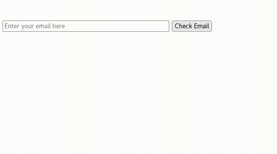

Clarusway

# JS-CC-004 : Email Validation

Purpose of the this coding challenge is to write a code that given email adresses, returns the emails valid or invalid.

- Valid email addresses must follow these rules:

1. It must have the username@websitename.extension format type.
1. The maximum length of the extension is 3.

## Expected Outcome

## Learning Outcomes

At the end of the this coding challenge, students will be able to;

- Analyze a problem, identify and apply programming knowledge for appropriate solution.

- Demonstrate their knowledge of algorithmic design principles by using JavaScript and Python effectively.

## Problem Statement

- Write a function that takes email variable and return `true` or `false` and write console `invalid` or `valid`.

- Please note that, extension length can be 2 or 3 letters( For example: `.co`, `com`. )

 ⌛ Happy Coding  ✍ 

