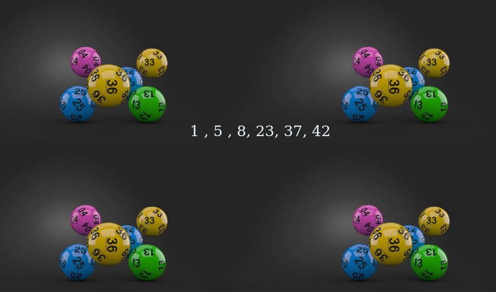

Clarusway

# JS-CC-005 : Lottery Game

A lottery is a form of gambling that involves the drawing of numbers at random for a prize. There can not be the same number in same lottery ticket. Therefore this array can not have any number more than once. Array should be sorted.

> **Examples:**
>
> [ 4, 10, 20, 30, 37, 47 ]  
> [ 11, 16, 25, 30, 34, 41 ]  
> [ 5, 7, 18, 26, 28, 47 ]

## Expected Outcome

## Learning Outcomes

At the end of the this coding challenge, students will be able to;

- Analyze a problem, identify and apply programming knowledge for appropriate solution.

- Demonstrate their knowledge of algorithmic design principles by using JavaScript and Python effectively.

## Problem Statement

- Write a function that generates an array ranging from 1 to 49(inclusive) and shift random six elements to the beginning of the array. Delete other elements(7 and beyond) of the array and sort the remaining numbers. This function should return these 6 numbers in a sorted ascending array.

- You are expected to define only one array for the purpose of the project, using spare array is not permitted.

**
&#9786; Happy Coding &#9997;
**
