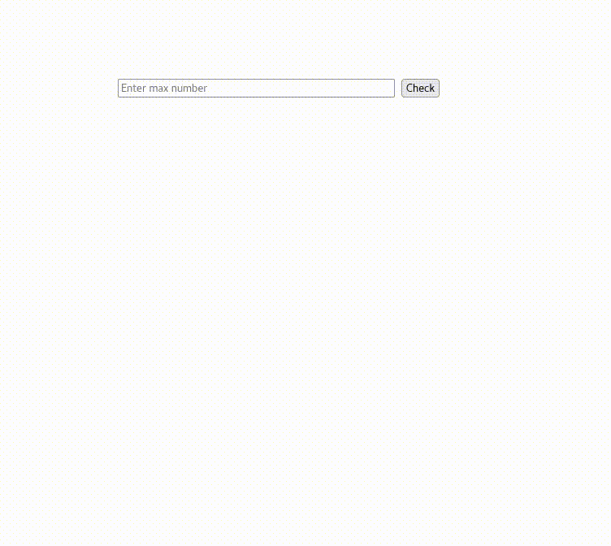

Clarusway

# JS-CC-008 : Fizz Buzz

Purpose of the this coding challenge is to write a code that given a Number, returns  fizz, buzz or fizzbuzz.

- Number must follow these rules:

1. If a number is divisible by three mark it as fizz.
2. If a number is divisible by five mark it as buzz.
3. If a number is divisible by both three and five, mark it as fizzbuzz.
4. Check up to the number received from the user.

## Expected Outcome

## Learning Outcomes

At the end of the this coding challenge, students will be able to;

- Analyze a problem, identify and apply programming knowledge for appropriate solution.

- Demonstrate their knowledge of algorithmic design principles by using JavaScript effectively.

## Problem Statement

- Write a function that takes number variable and returns fizz, buzz or fizzbuzz, according to rules.

- Present results on page not console.

 ⌛ Happy Coding  ✍ 

