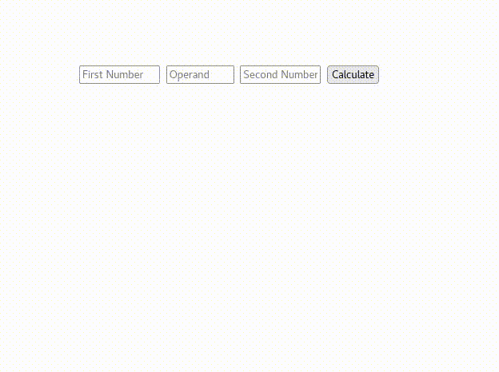

Clarusway

# JS-CC-009 : Simple Calculator

The purpose of this coding challenge is to make a calculator that can do a single operation.

## Expected Outcome

## Learning Outcomes

At the end of the this coding challenge, students will be able to;

- Analyze a problem, identify and apply programming knowledge for appropriate solution.

- Demonstrate their knowledge of algorithmic design principles by using JavaScript effectively.

## Problem Statement

- Take 2 number and operand from user.
- Calculate result and present on page.

 ⌛ Happy Coding  ✍ 

