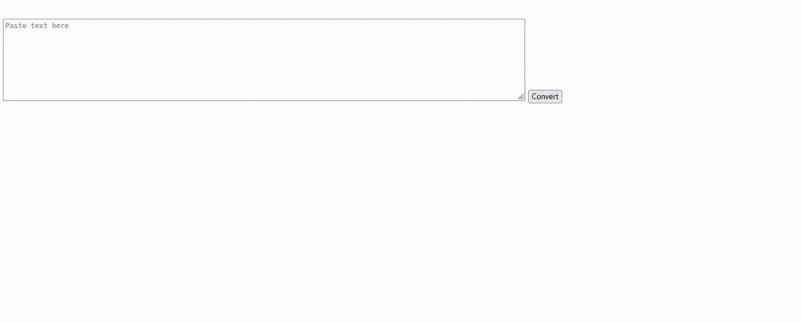

<p>Clarusway</p>

# JS-CC-011 : Capital Letters

The purpose of this coding challenge is to capitalize the first letter of each word in the given long text.


## Expected Outcome
```
There Are Many Variations Of Passages Of Lorem Ipsum Available, But The Majority Have Suffered Alteration In Some Form, By Injected Humour, Or Randomised Words which Don't Look Even Slightly Believable. If You Are Going To Use a Passage Of Lorem Ipsum, You Need To Be Sure There Isn't Anything Embarrassing Hidden In The Middle Of Text. All The Lorem Ipsum Generators On The Internet Tend To Repeat Predefined Chunks As Necessary, Making This The First True Generator On The Internet. It Uses A Dictionary Of Over 200 Latin Words, Combined With A Handful Of Model Sentence Structures, To Generate Lorem Ipsum Which Looks Reasonable. The Generated Lorem Ipsum Is Therefore Always Free From Repetition, Injected Humour, Or non-characteristic Words Etc.
```
​


## Learning Outcomes

At the end of the this coding challenge, students will be able to;

- Analyze a problem, identify and apply programming knowledge for appropriate solution.

- Demonstrate their knowledge of algorithmic design principles by using JavaScript effectively.

## Problem Statement

### Sample Input
```
There are many variations of passages of Lorem Ipsum available, but the majority have suffered alteration in some form, by injected humour, or randomised words which don't look even slightly believable. If you are going to use a passage of Lorem Ipsum, you need to be sure there isn't anything embarrassing hidden in the middle of text. All the Lorem Ipsum generators on the Internet tend to repeat predefined chunks as necessary, making this the first true generator on the Internet. It uses a dictionary of over 200 Latin words, combined with a handful of model sentence structures, to generate Lorem Ipsum which looks reasonable. The generated Lorem Ipsum is therefore always free from repetition, injected humour, or non-characteristic words etc.
```


<center> ⌛ Happy Coding  ✍ </center>
